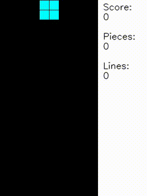
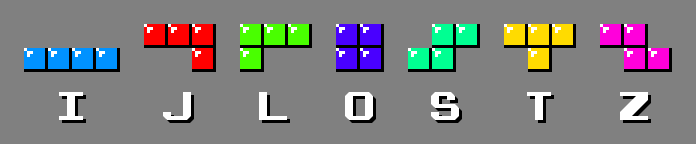

# Reinforcement learning obligatory program

The task is to create a tetris agent. The game is a simplified version of tetris, where you have to drop an element in each step.

In one step, you have to set two parameters: which column to place the element in, and which of the 4 rotation directions the element should face.

<p align="center">
  <br/>
</p>

# Tetris

The object of tetris is to place the 7 tetrominoes from the top of the board downwards so that they have as few holes between them as possible. If all the elements in a row are covered, that row disappears, leaving more space for new elements to be placed. [Detailed rules](https://tetris.wiki/Tetris_Guideline).

For example, anyone can try the game at: [tetr.io](https://tetr.io/)


The 7 types of tetrominoes are named in the figure below:
<p align="center">
  <br/>
</p>


# Environment

In the environment, each step is an element dropped from the top of the board.

The environment used is a custom [Gym](https://www.gymlibrary.dev/) environment:

|                   |                                                                                                    |
|-------------------|----------------------------------------------------------------------------------------------------|
| Action space      | <pre>MultiDiscrete([*boardWidth*  4])</pre>                                                        |
| Observation space | <pre>Dict(<br>  board: Box(0, 1, (*boardHeight*, *boardWidth*))<br>  piece: Discrete(7)<br>)</pre> |

Where *boardWidth* and *boardHeight* are the width and height of the board.

Actions:
 - The first parameter of the possible actions is the number of the column, indexed from 0, in which you want to place the leftmost frame of the element. If it is no longer possible to put an element in the column we have specified (for example, we want to put a "Z" element in the last column), the system will rank the element in the column with the best side that is still possible.
 - The second parameter is the rotation, which can be 4 directions for each element, even if they overlap for some elements.

Observations:
 - The observations are stored in a Dictionary with two keys: *board* and *piece*.
 - The *board* contains the current board in a 2-dimensional array, which is 0 if the field is empty and 1 if an element has been placed there.
 - The *piece* is an integer containing the identifier of the tetromino to be loaded, with a value from 0 to the number of elements - 1. Since the number of elements varies from environment to environment, a given tetromino may have different identifiers in different environments.
 - As the environment returns the elements in a Dictionary, for *stable-baselines3* it is recommended to use [MultiInputPolicy](https://stable-baselines3.readthedocs.io/en/master/modules/ppo.html#stable_baselines3.ppo.MultiInputPolicy) by default (see example codes). However, it would be possible to inherit and modify the base Tetris Gym class or wrap it and use other methods, for instance vision based ones.

The environment can be instantiated with the *TetrisGym* class, as follows:
 ```py
from tetris_gym.envs.tetris_gym import TetrisGym
env = TetrisGym()
 ```

Where the 3 parameters influencing gameplay are:
  - *width*: width of the board
  - *height*: height of the board
  - *pieces*: Names of the tetrominoes used in the game, possible values: *O, I, J, L, T, S, Z*

# Point calculation

Minden lerakott elem 1 pontot ér. Ha egy lerakott elem hatására eltűnnek sorok, akkor ez az eltűnt sorok száma a négyzeten szorozva a tábla szélességével további jutalmat jelent.

$$ score = 1 + clearedLines^2 * boardWidth $$

Ahol a *clearedLines* az eltűntetett sorok számát a *boardWidth* pedig a pálya méretét jelenti.
Ha mondjuk egy hagyományos 10 széles pályát egy lépéssel 3 sort eltüntetünk, akkor $1 + 3^2 * 10 = 91$ pontot kapunk.

Az alapértelmezett jutalom megegyezik a pontokkal.

# Telepítés és futtatás

A rendszer egyaránt használható google colabon és hagyományos számítógépeken. A környezet egy átlagos laptop processzorán is kényelmesen futtatható.

Példa [colab notebook](https://colab.research.google.com/drive/1ql97tMmdBu_349S6cxWMBxbeMUcoPr7v?usp=sharing).

Az alábbi útmutatóban [conda](https://docs.conda.io/en/latest/) virtuális környezetet fogunk használni.

Conda környezet létrehozása:

```bash
conda create -n tetris_gym python=3.10
conda activate tetris_gym
```

Rendszer letöltése és a csomagok telepítése:

```bash
git clone https://github.com/IPlayZed/tetris_gym_szte

cd tetris_gym_szte

pip install setuptools==65.5.0

pip install -r requirements.txt
```

Példakód kipróbálása:

```bash
python example.py
```

# Kiértékelés és követelmények

A végleges környezet a hagyományos Tetris játékhoz hasonlóan 10 széles és 20 magas táblát használ, a környezetben mind a 7 féle tetromino-t használjuk.

Az ágenst a [agent/agent.py](agent/agent.py) fájlban kell megvalósítani. Ezt fogja meghívni a végleges kiértékelő rendszer.

Az ágensben az *act* metódust kell módosítani, ami a környezetből kapott megfigyelés alapján visszaadja a következő lépést.

Ezzen felül a konstruktorban lehetőség van az ágensünk inicializálására, például egy korábban tanult modell betöltésére. Illetve, amennyiben használtunk *wrapper*-eket a környezet modosításához azokat is lehtőségünk van itt létrehozni.

Egy példa ágens, ami egy betanított Stable Baselines3 modellt használ az alábbi módon nézz ki:
  
  ```python
  from stable_baselines3 import A2C
from tetris_gym.wrappers.observation import ExtendedObservationWrapper

class Agent:
    """
    A kötelező programként beadandó ágens leírása.
    """

    def __init__(self, env) -> None:
        """
        A konsztruktorban van lehetőség például a modell betöltésére
        vagy a környezet wrapper-ekkel való kiterjesztésére.
        """
        
        self.model = A2C.load("agent/model_20x10")
        
        # A környezetet kiterjeszthetjük wrapper-ek segítségével.
        # Ha tanításkor modosítottuk a megfigyeléseket,
        # akkor azt a módosítást kiértékeléskor is meg kell adnunk.
        self.observation_wrapper = ExtendedObservationWrapper(env)

    def act(self, observation):
        """
        A megfigyelés alapján visszaadja a következő lépést.
        Ez a függvény fogja megadni az ágens működését.
        """

        # Ha tanításkor modosítottuk a megfigyeléseket,
        # akkor azt a módosítást kiértékeléskor is meg kell adnunk.
        extended_obsetvation = self.observation_wrapper.observation(observation)

        return self.model.predict(extended_obsetvation, deterministic=True)
  ```

## Felhasználható csomagok

Természetesen a Stable Baselines3 használata nem kötelező, lehetőség van tetszőleges modell, illetve egyénileg írt kód használatára is.

A kiértékelő rendszerben az alábbi csomagok vannak telepítve.

Új csomagok telepíthetők, ha erre van igényetek kérlek jelezzétek a kötelező programhoz létrehozott coospace forumon.

## Ranglista

A ranglista és a feltöltés az alábbi oldalon érhető el:

[https://chatbot-rgai3.inf.u-szeged.hu/rl/](https://chatbot-rgai3.inf.u-szeged.hu/rl/)

## Feltöltés

Az elkészült kódokat fel kell tötenetek HuggingFace-re. Majd, ha úgyérzitek, hogy minden rendben van, akkor a [ranglista oldalán](https://chatbot-rgai3.inf.u-szeged.hu/rl/upload/) tudjátok elindítani a hivatalos kiértékelést. Ehhez meg kell adnotok a HuggingFace repository nevét, ahova feltöltöttétek a kódotokat és a modelleket, a neptun azonosítótokat és egy megjelenítéshez használni kívánt nevet.

A HuggingFace repository-ba mindent fel kell tölteni, ami szükséges a kód futtatásához. Ez magában foglalja a kódokat és a szükséges modelleket. Az *agent.py*-nak a repository gyökérkönyvtárában kell lennie. Példát erre az alábbi repository-ban találtok: [szterlcourse/tetris_example](https://huggingface.co/szterlcourse/tetris_example/tree/main)

### Példa

Az alábbi [notebook](https://colab.research.google.com/drive/1iO9J_VzrtSIVcjC5a3q-9pk9UtfHX1SZ?usp=sharing), illetve a lenti parancsok megmutatják hogyan tudtok betanítani, leellenőrizni és feltöteni a Hugging Face-re egy ágenst.

A modellt betíníthatod a [trani.py](training/basic_sample.py) fájl segítségével, ez létre fog hozni egy modellt az *agent* mappában.
```bash
python basic_sample.py
```

Fontos, hogyha tanításkor modosítottál a tanuló algoritmuson, a megfigyeléseken... vagy csak egyéni szabályokat szeretnél írni, akkor már a korábban említett [agent/agent.py](agent/agent.py) fájlt kell ehhez módosítanod.

A kész ágenst az [evaluate.py](agent/evaluate_agent.py) fájl segítségével ellenőrizheted.
```bash
python evaluate_agent.py
```

A modellt feltöltheted a HuggingFace-re a [upload.py](agent/upload.py) fájl segítségével.

Ehhez viszont először meg kell adnod a fájlban a létrehozni (vagy felülírni) kívánt repository nevét. Illetve a Hugging Face tokenedet. Ezt az alábbi helyen tudod létrehozni a Hugging Face-en belül: [Settings/Access Tokens](https://huggingface.co/settings/token)

```python
# Ezt át kell írni a saját felhasználónevedre és az általad választott repó nevére
# Pl.: "szterlcourse/my_agent"
repo_id = ""

# Ide be kell írni a saját tokenedet, amit a Hugging Face oldalán tudsz létrehozni (https://huggingface.co/settings/token)
token = ""
```

Ha ezek megvannak, akkor a fájl futtatásával feltöltheted a Hugging Face-re a kódot és a modelleket.
```bash
python evaluate_agent.py
```

A feltöltést kézzel is megteheted, de ezekben van arra példa, hogy hogyan lehet kódból létrehozni egy Hugging Face repository-t és feltölteni bele a kódot és a modelleket.

## Hibák megjelentetése

Az utolsó feltöltés log-ját a neptun kódotok segítségébvel az alábbi link módosításával tudjátok megnézni:

[https://chatbot-rgai3.inf.u-szeged.hu/rl/log/\<NEPTUNKOD\>/](https://chatbot-rgai3.inf.u-szeged.hu/rl/log/NEPTUNKOD/)

Fontos, hogy a záró / szükséges.

# Követelmények
A kötelező programért szerezhető 30 pont begyűjtéséhez fel kell töltened egy rendszert, ami a szerveren történő kiértékeléskor legalább 40 score-t ér el.

A legjobb 5 felöltő mentesül az elméleti zh alól.

A további helyezések extra pluszpontokat érnek, amiknek a pontos szabályait a későbbiekben részletezzük.

## Köszönenyílvánítás

Köszönet  [Viet Nguyen](https://github.com/uvipen)-nek a tetris környezet alapjaiért.
